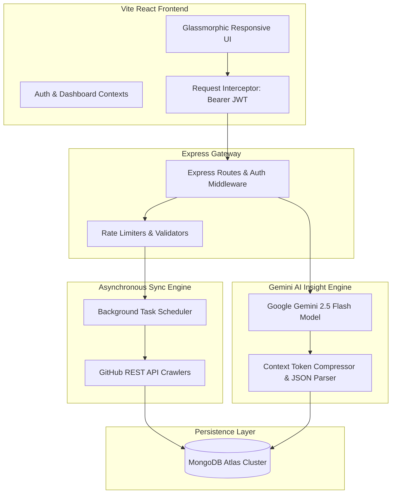
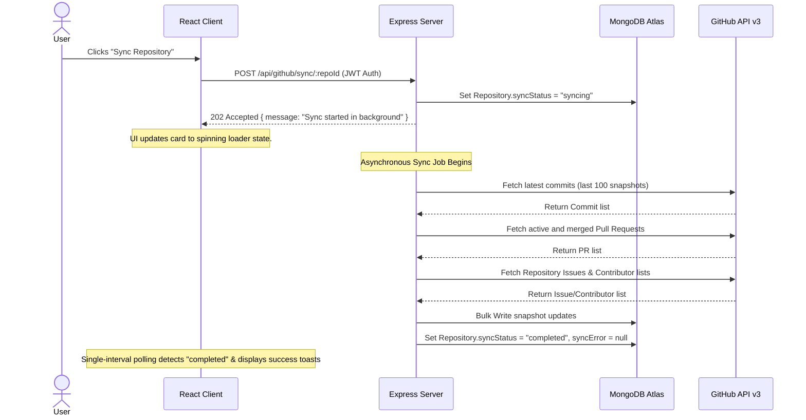
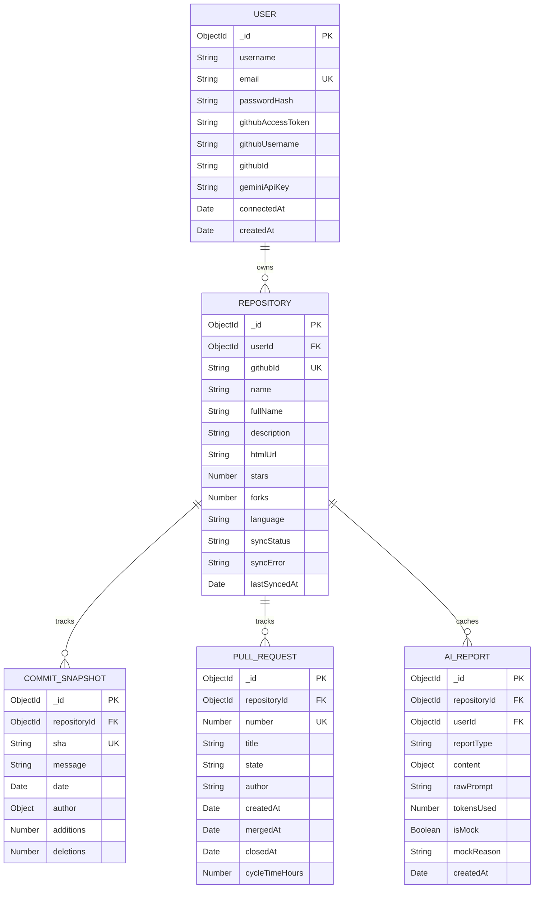

# DevTrackr: Enterprise-Grade AI-Powered Developer Productivity Platform

DevTrackr is a state-of-the-art, high-fidelity analytics and developer productivity dashboard. By integrating directly with GitHub OAuth and leveraging the cognitive capabilities of **Google Gemini 2.5 Flash**, DevTrackr translates raw version control events (commits, pull requests, issues, and contributor velocities) into actionable, executive software engineering summaries, bottleneck detections, and backlog prioritization maps.

Designed with decoupling in mind, the platform processes heavy VCS metric collections and neural AI assessments as non-blocking asynchronous background jobs. It renders insights through a responsive, premium glassmorphic dark-theme dashboard.

---

## 1. System Architecture & Flow Diagrams

### High-Level System Architecture


---

### Non-Blocking Background Repository Synchronization
When a developer triggers a sync command (or triggers "Sync All"), the sync is immediately offloaded to a background thread to prevent UI locking.




## 2. Database Schema Design

The persistence layer is structured using Mongoose across five primary schemas to store normalized snapshot histories, credentials, and cached reports.



### Schema Attributes & Types

#### 1. User Schema (`User.js`)
*Represents the primary developer credential record.*
- **`username`** (String, Required): Display name of the user.
- **`email`** (String, Required, Unique, Lowercase): Authentication email.
- **`passwordHash`** (String, Required): Hashed password using bcrypt.
- **`githubAccessToken`** (String, Default: null): OAuth access token for GitHub operations.
- **`githubUsername`** (String, Default: null): Associated username on GitHub.
- **`githubId`** (String, Default: null): GitHub unique ID.
- **`geminiApiKey`** (String, Default: null): Personal Google Gemini API key override.
- **`connectedAt`** (Date): Timestamp when the user linked their GitHub account.

> [!NOTE]
> To prevent credential leakage, the `UserSchema.methods.toJSON` function automatically strips `passwordHash`, `githubAccessToken`, and `geminiApiKey` before returning data, instead attaching a safe virtual boolean indicator `hasCustomGeminiKey`.

#### 2. Repository Schema (`Repository.js`)
*Represents a linked repository monitored by the dashboard.*
- **`userId`** (ObjectId, Ref: User): Owner who connected this repository.
- **`githubId`** (String, Required): GitHub's internal database ID.
- **`name`** (String): Repository short name.
- **`fullName`** (String): Fully-qualified name (e.g. `owner/repo`).
- **`syncStatus`** (String, Enum: `idle`, `syncing`, `completed`, `failed`): Current background status.
- **`lastSyncedAt`** (Date): Timestamp of the last successful background sync.

#### 3. Commit Snapshot Schema (`CommitSnapshot.js`)
*Represents history snapshots used for velocity analytics.*
- **`repositoryId`** (ObjectId, Ref: Repository): Associated parent repository.
- **`sha`** (String, Required): Complete 40-character Git commit hash.
- **`message`** (String): Commit message description.
- **`author`** (Object: `{ login: String, name: String, avatarUrl: String }`): Committer metadata.
- **`additions`** / **`deletions`** (Number): Physical code lines added or deleted.

#### 4. Pull Request Schema (`PullRequest.js`)
*Tracks reviewing cycles, merges, and stale hot-spots.*
- **`number`** (Number): Pull Request identification number on GitHub.
- **`state`** (String, Enum: `open`, `closed`, `merged`): Review state.
- **`cycleTimeHours`** (Number): Total elapsed hours from PR creation to merge/close.

#### 5. AI Report Schema (`AIReport.js`)
*Caches historical Gemini reports to minimize API usage.*
- **`reportType`** (String, Enum: `sprint`, `contributor`, `bottleneck`, `prioritization`): Category.
- **`content`** (Object): Parsed JSON recommendations and velocity summaries.
- **`isMock`** (Boolean, Default: false): Indicates if the report fallback-rendered as simulated telemetry due to key/quota limitations.
- **`mockReason`** (String): Diagnostic description detailing why the simulation mode ran.

---

## 3. Technology Stack & Key Dependencies

DevTrackr uses a modern, high-performance tech stack aligned for responsive, dark-navy aesthetics:

### Core Frameworks & Tooling
1. **Frontend**: React 18 (bootstrapped with Vite) + React Router 6.
2. **Styling**: Vanilla CSS custom design tokens + Tailwind CSS 3.4 for layout grids.
3. **Typography**: Google Fonts Outfit (headings) + JetBrains Mono (metrics and commit SHAs).
4. **Backend**: Node.js + Express 4.
5. **Database**: MongoDB Atlas cloud cluster + Mongoose 8.4.
6. **AI Orchestrator**: `@google/generative-ai` SDK.

### Primary NPM Dependencies
- **`recharts`**: Renders all visual metrics (Area charts for commit trends, circular charts for PR distributions, and vertical bar charts for sprint velocity).
- **`jspdf` & `html2canvas`**: Captures screen layouts and outputs branded, executive-quality PDF reports.
- **`bcryptjs` & `jsonwebtoken`**: Manages secure hash generation and JWT token signing.
- **`express-rate-limit`**: Implements protection against DDoS and high-frequency API abuse.

---

## 4. Key Engineering Implementations & Core Design

### A. Context Payload Token Footprint Optimization
Raw MongoDB lists stringified and sent to Gemini quickly exhaust the token constraints of the free tier. DevTrackr implements an object-mapping compression layer in `ai.service.js` that filters raw database queries down to essential metrics:
- Abbreviates 40-character SHAs to 7-character Git hashes.
- Strip all metadata variables (`_id`, `__v`, nested keys).
- Reduces commit objects to `sha`, `message`, `author`, `date`, `additions`, and `deletions`.
- **Outcome**: Context payload size is **compressed by 75% to 90%**, extending API usage limits while preserving analytical accuracy.

### B. Single-Interval Concurrent Polling Engine
Rather than creating separate interval loops for each repository triggering updates—which causes network congestion and layout lag—the platform uses a unified polling architecture:
- Monitors a dynamic Set of syncing repository IDs (`syncingRepoIdsRef`) in `DashboardContext.jsx`.
- When repository syncs are triggered, their IDs are added to the Set, starting a single interval loop.
- The interval requests a single unified update from the backend, updates active states in parallel, and unmounts once the syncing Set is empty.

### C. Seamless Direct GitHub Authentication
DevTrackr replaces typical email-only structures with a public OAuth sign-in option:
- **`GET /api/github/login`**: Redirects the browser directly to GitHub's authorization consent screen using a JWT-signed state token containing `login: true`.
- **Unified Callback**: Receives the return code, exchanges it for an access token, fetches the user's GitHub profile, and attempts to find a matching account in MongoDB.
- **Automatic Onboarding**: If no user is linked to that account or email, it creates a new account on-the-fly (with a random, cryptographically secure password) and signs a website access JWT, immediately redirecting the user into the **main dashboard**.

### D. Offline Resilience & Crash Protection
Outgoing server fetches to the GitHub API are wrapped in nested try-catch locks. If a host loses internet connection, the system attempts to fetch local cached database records. If the connection to Mongoose Atlas is also lost, the backend catches the error and degrades gracefully (returning `503 Service Unavailable`) rather than triggering an unhandled promise rejection and crashing the Node.js server.

---

## 5. Getting Started & Installation

### Prerequisites
- Node.js (v18 or higher)
- npm (v9 or higher)
- A running MongoDB instance (or Atlas connection URI)
- A GitHub OAuth Application (Client ID & Client Secret)
- A Google Gemini API Key

---

### Step 1: Configuration & Environment Setup

Create a `.env` file inside the `devtrackr/server/` directory:

```env
# Application Host Settings
PORT=5000
NODE_ENV=production

# Database Configuration
MONGO_URI=mongodb+srv://<username>:<password>@<cluster>.mongodb.net/devtrackr?retryWrites=true&w=majority

# JWT Configurations
JWT_SECRET=your_jwt_super_secret_key_here
JWT_EXPIRES_IN=24h

# GitHub OAuth App Credentials
GITHUB_CLIENT_ID=your_github_client_id_here
GITHUB_CLIENT_SECRET=your_github_client_secret_here
GITHUB_REDIRECT_URI=http://localhost:5000/api/github/callback

# Google Gemini API Key Config
GEMINI_API_KEY=your_gemini_api_key_here
```

---

### Step 2: Install Server Dependencies & Start Backend

```bash
cd devtrackr/server
npm install
npm run dev
```
The server will boot and run on `http://localhost:5000`.

---

### Step 3: Install Client Dependencies & Run Frontend

Open a new terminal tab:

```bash
cd devtrackr/client
npm install
npm run dev
```
Vite will start the client on `http://localhost:5173`. Open your browser and navigate to the address to inspect the platform!

---

### Step 4: Build for Production

To create a minified, fully compiled production bundle:

```bash
cd devtrackr/client
npm run build
```
This outputs a optimized distribution bundle in `client/dist/`, ready to be served by any static host or web proxy.
